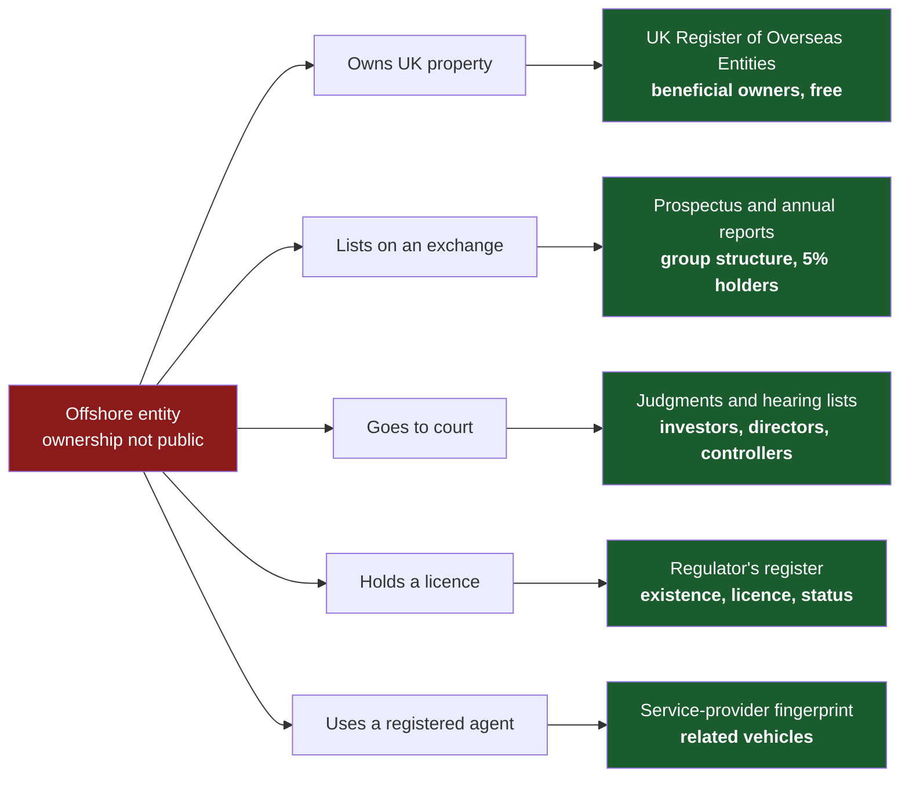

# Awesome Offshore OSINT 

> How to research companies in offshore financial centres — who owns them, who runs them, and where they have been sued — from official sources, free routes first.

Offshore registers are designed to say as little as possible. Most will confirm that a company exists and little more; beneficial ownership sits in registers the public cannot query.

But offshore entities do business in places that *do* publish. The moment one buys property in London, lists in Hong Kong, takes a licence or goes to court, the information its home registry protects becomes public **somewhere else**. This list documents, jurisdiction by jurisdiction, what each official source actually returns, what it costs — and where the information leaks.

## Contents

- [Jurisdictions](#jurisdictions)
- [At a glance](#at-a-glance)
- [Where offshore ownership leaks](#where-offshore-ownership-leaks)
- [A method for any offshore entity](#a-method-for-any-offshore-entity)
- [Cross-border resources](#cross-border-resources)
- [Offshore terms that matter](#offshore-terms-that-matter)
- [Contributing](#contributing)
- [License](#license)

## Jurisdictions

### Caribbean and Atlantic

- [🇧🇸 The Bahamas](countries/bahamas.md) — international business companies, funds and digital-asset businesses. Expensive registry, free appellate judgments.
- [🇧🇲 Bermuda](countries/bermuda.md) — insurance and reinsurance, exempted companies, segregated accounts companies. The regulator's register is the free shortcut.
- [🇻🇬 British Virgin Islands](countries/british-virgin-islands.md) — the highest-volume offshore company domicile. No free company search; research it through the BVI Commercial Court.
- [🇰🇾 Cayman Islands](countries/cayman-islands.md) — funds, segregated portfolio companies and listed holding companies. Eleven techniques for finding what the registry will not sell you.
- [🇵🇦 Panama](countries/panama.md) — corporations and private interest foundations. The most open company registry in this collection: free deeds and named directors.

### Crown Dependencies

- [🇬🇬 Guernsey](countries/guernsey.md) — companies, foundations and limited partnerships, all in one searchable registry.
- [🇮🇲 Isle of Man](countries/isle-of-man.md) — free registry search with a filing index; the entity-number suffix tells you what you are looking at.
- [🇯🇪 Jersey](countries/jersey.md) — trusts and funds. Free company search, beneficial ownership register since 1989 (not public).

### Europe and the Mediterranean

- [🇨🇾 Cyprus](countries/cyprus.md) — holding companies and investment firms. Directors and secretary are free on the public register.
- [🇬🇮 Gibraltar](countries/gibraltar.md) — online gambling, insurance and DLT businesses. Shareholders are on the register, behind a paid subscription.

### Indian Ocean

- [🇸🇨 Seychelles](countries/seychelles.md) — high-volume international business companies. Thin registry, free court archive.

### Asia

- [🇭🇰 Hong Kong](countries/hong-kong.md) — listed groups and the holding layers beneath them. Exchange filings and Webb-site do what the registry does not.

### Onshore jurisdictions

The same method, applied to two onshore registers.

- [🇮🇪 Ireland](countries/ireland.md) — free company search, priced documents, open courts.
- [🇪🇸 Spain](countries/spain.md) — no company lookup; reconstruct the company from the BORME gazette.

## At a glance

What the public can get, per jurisdiction. Details, caveats and links are on each page.

| Jurisdiction | Company search | Beneficial ownership register | Free court judgments |
|---|---|---|---|
| [The Bahamas](countries/bahamas.md) | Paid, ~BSD 100 per search | Authorities only | Court of Appeal |
| [Bermuda](countries/bermuda.md) | Account required; documents BMD 70–300 | Not public (central register since Nov 2025) | Online from ~2007; Cause Book and Register of Judgments in person only |
| [British Virgin Islands](countries/british-virgin-islands.md) | No free search; via registered agent or paid | Legitimate interest from Apr 2026 — **owner is notified** | Eastern Caribbean Supreme Court |
| [Cayman Islands](countries/cayman-islands.md) | Paid, from ~US$37 per item | Legitimate interest, ~CI$250 a year (2026) | Unreported judgments, full text from 2020 |
| [Cyprus](countries/cyprus.md) | **Free**, includes directors | Closed to the public since Jan 2023 | CyLaw, from 1883 (mostly Greek) |
| [Gibraltar](countries/gibraltar.md) | Paid subscription | Authorities only | Limited — use the Privy Council |
| [Guernsey](countries/guernsey.md) | Online registry portal | Mostly closed; "some" information public | From 2003; Royal Court Orders from 1949 |
| [Hong Kong](countries/hong-kong.md) | Free basic; directors ~HK$22 | No central register — kept by each company | From 1946 (LRS), plus HKLII |
| [Ireland](countries/ireland.md) | Free basic; documents €3–15 | Restricted; legitimate-interest route | Courts Service, plus daily Legal Diary |
| [Isle of Man](countries/isle-of-man.md) | **Free**, documents paid | Authorities and licensed service providers | Judgments Online, from 2002 |
| [Jersey](countries/jersey.md) | **Free** | Authorities and obliged entities | Unreported judgments from 1995 |
| [Panama](countries/panama.md) | **Free** (account), deeds downloadable | Private by design | Órgano Judicial (Spanish) |
| [Seychelles](countries/seychelles.md) | Extract confirming basic details and status | Not public | SeyLII |
| [Spain](countries/spain.md) | Free gazette (BORME); registry extracts paid | Obliged entities and legitimate interest | CENDOJ, full text |

**Quick answers**

- **Directors free:** Cyprus, Panama — and Spain, reconstructed from BORME appointment acts.
- **Directors for a fee:** Cayman (~US$61, current directors only), Hong Kong (~HK$22), Gibraltar (subscription), Ireland (per filing).
- **Directors not public at all:** British Virgin Islands, Isle of Man.
- **Shareholders on a public register:** Gibraltar (paid).
- **Records that exist only offline:** Bermuda's Supreme Court Cause Book and Register of Judgments.

## Where offshore ownership leaks

1. **Foreign registers.** Any overseas entity owning qualifying UK property must register with [UK Companies House](https://find-and-update.company-information.service.gov.uk/) and publicly declare its beneficial owners — free, no account. Look for the `OE` prefix. Only covers entities holding UK land; absence proves nothing. → [Cayman Islands](countries/cayman-islands.md)
2. **Litigation.** Offshore courts publish what offshore registries will not. Commercial, insolvency and asset-recovery judgments name shareholders, directors and the structures behind a dispute. The BVI Commercial Court alone hears a large share of the world's offshore shareholder and insolvency disputes. → [BVI](countries/british-virgin-islands.md) · [Cayman Islands](countries/cayman-islands.md) · [Seychelles](countries/seychelles.md)
3. **The Privy Council.** The [Judicial Committee of the Privy Council](https://www.jcpc.uk/) is the final court of appeal for the Bahamas, Bermuda, the BVI, Cayman, Gibraltar, Guernsey, the Isle of Man and Jersey. Its judgments are free, fully public, and often the most detailed account of a long-running offshore dispute.
4. **Listing documents.** Prospectuses must show the full group structure — typically a Cayman topco, BVI intermediate holding companies and a Hong Kong subsidiary, with percentages on every arrow — plus directors and substantial shareholders. → [Cayman Islands](countries/cayman-islands.md) · [Hong Kong](countries/hong-kong.md)
5. **Regulators before registrars.** Offshore regulators publish free registers of licensed banks, insurers, funds and service providers. For many entities that matter, the regulator confirms existence and status without paying the registry. → [Bermuda](countries/bermuda.md) · [The Bahamas](countries/bahamas.md) · [Gibraltar](countries/gibraltar.md)
6. **The registered agent.** Every BVI company, and every Seychelles and Bahamas IBC, has a licensed agent — and agents cluster. Identify the agent and you have identified the service provider who built the structure — and its other vehicles. → [BVI](countries/british-virgin-islands.md) · [Seychelles](countries/seychelles.md) · [Isle of Man](countries/isle-of-man.md)

## A method for any offshore entity

1. **Pin the exact entity.** Name, jurisdiction and registration number. Near-identical names are registered across the BVI, Seychelles, Panama and elsewhere — a name match is not an entity match.
2. **Read the identifier.** Number formats often encode the entity type: the Isle of Man suffix, the Cyprus `HE` prefix, the Spanish NIF letter.
3. **Check the regulator.** Free, and often more informative than the registry.
4. **Search the registry — free routes first.** Pay only when the free routes come up empty and you need an official answer.
5. **Search the courts.** By company name, by name stem, by registered agent, by liquidator and by suspected principal — locally and at the Privy Council.
6. **Look abroad.** UK Register of Overseas Entities, SEC EDGAR, HKEXnews — wherever the entity had to file.
7. **Read status with its date.** "Struck off" is not "dissolved"; BVI and Cayman companies are restored. Re-check in a live matter.
8. **Corroborate leaks.** Leak datasets are not registries. Confirm anything from a leak against the official record before relying on it.

## Cross-border resources

**Official**

- [UK Companies House](https://find-and-update.company-information.service.gov.uk/) — includes the Register of Overseas Entities, with beneficial owners of offshore entities that hold UK property. Free.
- [Judicial Committee of the Privy Council](https://www.jcpc.uk/) — final court of appeal for eight offshore jurisdictions. Free.
- [Eastern Caribbean Supreme Court](https://www.eccourts.org/) — superior court for the BVI and eight other OECS states and territories. Free judgments.
- [SEC EDGAR full-text search](https://www.sec.gov/edgar/search/) — search a registered office address to enumerate a service provider's client entities. Full text from 2001.
- [HKEXnews](https://www.hkexnews.hk/) — prospectuses and disclosure-of-interests filings for Hong Kong listed issuers, many of them Cayman holding companies.

**Independent**

- [Open Ownership — jurisdiction map](https://www.openownership.org/en/map/) — the current state of each beneficial ownership regime. Access rules change often; check here.
- [ICIJ Offshore Leaks](https://offshoreleaks.icij.org/) — entities and people from the offshore leak datasets. Corroborate before relying on it.
- [OCCRP Aleph](https://aleph.occrp.org/) — aggregated registries, leaks, court records and procurement data.
- [OpenSanctions](https://www.opensanctions.org/) — sanctions, PEP and watchlist data with entity resolution.

## Offshore terms that matter

| Term | What it means for research |
|---|---|
| **Registered agent / resident agent** | The licensed local firm every offshore company must appoint. Holds the beneficial ownership record; its identity is a fingerprint of the service provider behind the structure. |
| **International business company (IBC)** | The standard offshore vehicle in the Bahamas and Seychelles, built for minimal public disclosure. |
| **Exempted company** | Permitted to operate from Bermuda or Cayman but not to trade locally. Normal for the jurisdiction; not itself a red flag. |
| **Segregated portfolio / accounts company** | One registered company containing ring-fenced portfolios or accounts. A portfolio is not a separate legal person — registry searches for it fail, judgment searches often succeed. |
| **Private interest foundation** | Panama's asset-holding vehicle. Founding documents are registrable; the *reglamento* naming beneficiaries is not filed. |
| **Nominee director / shareholder** | A name supplied by a service provider. Recurring nominee names identify the provider, not the owner. |
| **Legitimate-interest access** | Beneficial ownership access on application. In the BVI, the beneficial owner is told who asked. |
| ***WM and Sovim* (C-37/20)** | The 2022 CJEU judgment that ended public access to EU beneficial ownership registers, including Cyprus, Ireland and Spain. |
| **Struck off** | Removed from the register, but restorable — not the same as dissolved. |

## Contributing

Pull requests welcome. Please keep to the scope — company search, beneficial ownership and court search — and for each addition state what the resource actually returns, whether it is free, and what access it requires. Techniques are as welcome as links: say how to run it, what it returns and where it breaks.

New offshore jurisdictions are especially wanted — for example Belize, Liechtenstein, the Marshall Islands and Mauritius. Follow the structure of the existing pages in [`countries/`](countries/).

## License

[CC0 1.0 Universal](LICENSE) — public domain dedication. The linked resources remain subject to their own terms.
