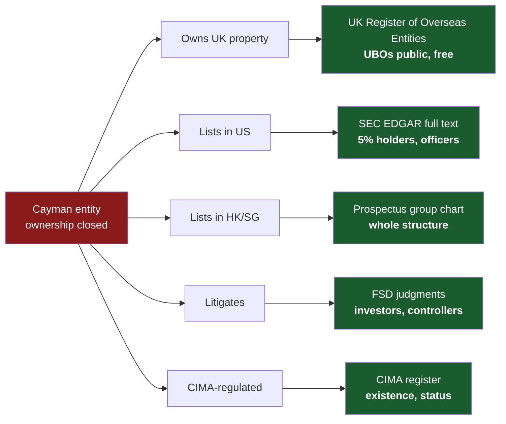

# Awesome OSINT — Cayman Islands 🇰🇾

The General Registry has no free search. The beneficial ownership register is legitimate-interest only. Every guide tells you this and stops.

This one does not stop. Cayman entities do business in jurisdictions that *do* publish — and the moment a Cayman company buys a London flat, lists in New York, sues in Grand Court or files a prospectus in Hong Kong, the thing Cayman protects becomes free and public **somewhere else**.

What follows is eleven techniques for finding it. Not a link dump — the links are at the bottom, deliberately.

*Verified 2026-09-18.*

---

## Where Cayman ownership actually leaks

---

## The eleven techniques

### 1. The UK Register of Overseas Entities — free public Cayman UBOs

**The single most valuable thing on this page.**

Since 2022, any overseas entity owning qualifying UK property must register with UK Companies House and **publicly declare its beneficial owners**. No fee, no account, no legitimate interest test. A large number of Cayman entities hold UK real estate.

**How:** search the Cayman company name at [UK Companies House](https://find-and-update.company-information.service.gov.uk/). Overseas entities carry an `OE` prefix on their registration number. Open the entity, then the beneficial owners section.

**Why it is rare:** it inverts the jurisdiction. You are reading a Cayman entity's beneficial ownership from a *British* register, for free, because Parliament decided UK property transparency outranks Cayman privacy. Practitioners who only search Cayman sources never see it.

**Limit:** only captures entities holding UK land. Absence proves nothing.

---

### 2. Search the registered office address, not the company name

Cayman's corporate population clusters at a handful of service-provider addresses. The most famous is:

> `PO Box 309, Ugland House, South Church Street, George Town, Grand Cayman KY1-1104`

Others sit at Cricket Square, Boundary Hall, Harbour Place, and the offices of the major offshore firms.

**How:** put the address — in quotes — into [SEC EDGAR full-text search](https://www.sec.gov/edgar/search/). Every SEC filer using that registered office surfaces at once. Repeat across HKEX, SGX and LSE disclosure archives.

**Why it is rare:** you stop searching for *an entity* and start enumerating *a service provider's entire client portfolio*. One address query returns hundreds of related vehicles that share an administrator, and frequently share principals. This is how you find the siblings of a company you already know.

**Note:** EDGAR full-text indexing begins **4 May 2001** and covers 400+ form types, with Boolean operators, exact-phrase quoting and wildcards. Filings from 1993–2001 exist on EDGAR but are *not* keyword-searchable — browse those by company and form type.

---

### 3. CIMA category enumeration — census, not lookup

Everyone uses the [CIMA regulated-entities search](https://www.cima.ky/search-entities-cima) to check one name. Almost nobody uses it the other way.

**How:** query by **licence category** rather than name — `type:Private Fund`, `type:Virtual Asset Service Provider Licence`, `type:Mutual Fund Administrator`, and so on across roughly 35 categories. Passing a category with no name is valid and returns the whole population.

**Why it is rare:** it converts a verification tool into a **sector census**. You can enumerate every VASP licensed in Cayman, every private fund, every trust company — then diff that list month over month to see entrants and exits. For sector research, sanctions work or typology studies this is the only free population-level data the jurisdiction emits.

**Limit:** hard-capped at roughly five pages of ~100 rows per query. Slice by category to stay under it.

---

### 4. Mine the listing prospectus, not the registry

Nearly every Chinese company listed in Hong Kong or New York is a **Cayman holdco**. So are a large share of crypto, biotech and SPAC issuers.

**How:** find the IPO prospectus or annual report on [HKEXnews](https://www.hkexnews.hk/) or [EDGAR](https://www.sec.gov/edgar/search/) and go straight to the **corporate structure chart**. Listing rules require a full group diagram — typically Cayman topco, BVI intermediate holdcos, a Hong Kong subsidiary and the onshore operating entities, with percentages on every arrow.

**Why it is rare:** a single prospectus page gives you the complete multi-jurisdiction structure — including the BVI layer, which is *also* closed — at a level of detail no registry in any of those jurisdictions would sell you. Prospectuses also name directors, their other directorships, substantial shareholders above 5%, and the ultimate controlling shareholder.

---

### 5. Cause-number clustering in the FSD

Cayman cause numbers are sequential within a year: `FSD 123 of 2025`.

**How:** when you find one relevant FSD matter, **look at the numbers immediately around it**. Petitions filed the same day sit in adjacent slots.

**Why it is rare:** when a fund structure collapses, the feeder, the master and the SPC portfolios are frequently wound up in **simultaneous petitions filed together**. Consecutive cause numbers therefore reveal the rest of the structure — entities you had no name for. Nothing in the search interface suggests this; it falls out of how the registry assigns numbers.

Cross-match against the [Grand Court hearing list](https://judicial.ky/hearing-list/grand-court/) to see which of the cluster are still live.

---

### 6. Use the liquidator or the law firm as the search key

Cayman insolvency work concentrates in a small number of restructuring practices, and the same joint official liquidators recur across matters.

**How:** search the [unreported judgments database](https://judicial.ky/judgments/unreported-judgments-advanced-search/) for a **liquidator's name** or a **firm name** rather than the company.

**Why it is rare:** it returns that practitioner's entire visible caseload. If you are mapping a collapsed fund group, the liquidator is the connective tissue between proceedings that share no common company name. Party-name search finds one case; liquidator-name search finds the pattern.

---

### 7. Search the name stem, not the name

Cayman fund structures are named systematically:

| Pattern | Meaning |
|---|---|
| `XYZ Fund Ltd` | Feeder |
| `XYZ Master Fund Ltd` | Master |
| `XYZ Offshore Ltd` / `XYZ Offshore Fund` | Offshore feeder |
| `XYZ SPC` | Segregated portfolio company |
| `XYZ SPC — Portfolio A` | Individual segregated portfolio |
| `XYZ GP Ltd` | General partner of an ELP |
| `XYZ (Cayman) Holdings` | Holdco layer |

**How:** search the **stem** (`XYZ`) across judgments, EDGAR and CIMA — never the full legal name.

**Why it matters:** in a master-feeder structure the feeder and master are separate legal persons with separate filings and separate litigation. Searching one exact name reliably finds one leg of a structure that has three or more. Each segregated portfolio of an SPC must carry its own distinct designation — but **a portfolio is not a separate legal person**, so searching the portfolio name in a registry will fail while searching it in a *judgment* often succeeds.

---

### 8. File a Cayman FOI request — from anywhere, under a pseudonym

Cayman has a Freedom of Information Act, and it is unusually open about who may use it.

- **Anyone** may request, "regardless of nationality, physical location or age."
- You may use **an alias or pseudonym**.
- You need give **no reason** for the request and no statement of intended use.
- Written acknowledgement within **10 days**; a decision within **30 days**, extendable once for good cause.
- The **[Ombudsman](https://ombudsman.ky/foi)** is the independent supervisory authority and hears appeals.

**How:** identify the public authority likely to hold the record, find its Information Manager via the government's [FOI pages](https://gov.ky/freedom-of-information), and email the request.

**Why it is rare:** virtually no Cayman OSINT guide mentions FOI at all. It does not reach the company registry or the BO register — but it does reach **government contracts, regulatory correspondence, planning and licensing decisions, and public-authority dealings with named companies**. A foreign journalist can lawfully use it without leaving their desk.

---

### 9. Read CSX listing particulars

The [Cayman Islands Stock Exchange](https://www.csx.ky/) lists funds, debt and structured products — and its listing particulars are **free**.

**Why it is rare:** listing documents routinely name the investment manager, administrator, custodian, auditor and directors, and describe the structure and fee arrangements in detail. For a Cayman fund that is *not* listed in New York or Hong Kong, a CSX listing is often the only free document of that depth in existence. Practitioners overwhelmingly check CIMA and stop.

---

### 10. Treat hearing lists as a leading indicator

Judgments appear *after* a matter concludes. The [Grand Court](https://judicial.ky/hearing-list/grand-court/), [Court of Appeal](https://judicial.ky/hearing-list/court-of-appeal/) and [Summary Court](https://judicial.ky/hearing-list/summary-court/) hearing lists show matters that are **live right now**.

**Why it is rare:** a winding-up petition appears on the hearing list weeks or months before any judgment exists — and in a large number of matters *no written judgment is ever produced*. A name that appears only in hearing lists is litigation that judgment-database searching will never find.

---

### 11. Subscribe to the judgment alerts

The court runs an [unreported judgments notification list](https://judicial.ky/judgments/unreported-judgments-notification-email-list/).

**Why it is rare:** it turns a manual re-check into passive monitoring on a jurisdiction whose corporate record you otherwise cannot watch at all. For a live matter, this is the closest Cayman offers to a change-of-status alert.

---

## What does *not* work — save yourself the time

- **OpenCorporates has no meaningful Cayman company data.** The registry sells its data; it is not bulk-licensed. Do not treat a blank as evidence of non-existence.
- **There is no free company search, at any price point, anywhere.** Every General Registry product is paid and per-item.
- **There is no reverse director lookup.** You cannot go from a person to their Cayman directorships through any official source. Directors *are* purchasable company-by-company — see [what you can buy](#what-you-can-buy) — but only the current ones, with no history and no dates.
- **Shareholders are never public.** The register of members is company-held and never filed.
- **Cayman trusts are not registered.** A Cayman company acting as trustee reveals nothing about the trust.
- **Segregated portfolios are not legal persons.** Searching a portfolio designation in the registry will fail by design.
- **`CORIS` is not for you** unless you are a CIMA-licensed service provider administering the entity.
- **"Struck off" is not "dissolved."** Cayman companies are struck off and later restored. Always read status *with* status date, and re-check in a live matter.

---

## What you can buy

Registry data is paid and per-item, ordered through the [Cayman Business Portal](https://www.cbp.ky/) with an email address and one government ID. Three products matter:

| Product | Indicative cost | What it returns |
|---|---|---|
| **General search** | ~US$36.59 | Legal name, entity type, registration number, current standing, incorporation date, registered office address. **No directors.** |
| **Detailed inspection** | ~US$60.98 | Summary of the constitutional documents — memorandum and articles |
| **Current directors inspection** | ~US$60.98 | **Names of the current directors, and current alternate directors where applicable** |

**Directors are obtainable.** This is worth stating plainly, because Cayman's reputation for opacity leads people to assume otherwise: the Companies Act requires the Registrar to make available the names of a company's current directors and alternate directors, and the third product above is how you get them. Sixty dollars, no legitimate-interest test, no local agent required.

**What sixty dollars does not buy:**

- **History.** Current directors only. No former directors, no appointment or resignation dates, no way to establish who was on the board on a given past date.
- **Direction of travel.** Because there are no dates, two inspections months apart are the only way to detect a board change — and they will tell you *that* it changed, not *when*.
- **Shareholders.** The register of members is company-held and never filed. No product exposes it.
- **Reverse lookup.** Company-in, names-out. There is no person-in, companies-out search at any price.

Order of operations matters: run the [free checks](#the-eleven-techniques) first, because a listing prospectus or an FSD judgment frequently gives you directors *with* dates and history for nothing — which is strictly better than the paid product. Buy the inspection when the free routes come up empty and you need a defensible, current, official answer.

**CORIS** — the [Cayman Online Registry Information System](https://coris.gov.ky/) — offers remote registry access, but only to CIMA-licensed service providers administering their own client entities, at roughly CI$125 setup and CI$125/month upward. It is not a research route.

---

## Reference: the sources themselves

**Registry (all paid)** — [General Registry](https://www.ciregistry.ky/) · [Company search FAQ](https://www.ciregistry.ky/faq_category/company-search/) · [Cayman Business Portal](https://www.cbp.ky/) · [CORIS](https://coris.gov.ky/)

**Regulators (free)** — [CIMA regulated entities](https://www.cima.ky/search-entities-cima) · [CIMA](https://www.cima.ky/) · [CSX](https://www.csx.ky/)

**Courts (free)** — [Unreported judgments](https://judicial.ky/judgments/unreported-judgments/) · [Advanced search](https://judicial.ky/judgments/unreported-judgments-advanced-search/) *(full text from 2020)* · [Public registers](https://judicial.ky/public-registers/) · [FSD Users Guide](https://judicial.ky/wp-content/uploads/FSD-Users-Guide-On-website.pdf) · [Privy Council](https://www.jcpc.uk/) · [CNS Library](https://cnslibrary.com/courts/)

**Elsewhere (free, and where the ownership is)** — [UK Companies House](https://find-and-update.company-information.service.gov.uk/) · [SEC EDGAR FTS](https://www.sec.gov/edgar/search/) · [HKEXnews](https://www.hkexnews.hk/) · [ICIJ Offshore Leaks](https://offshoreleaks.icij.org/) · [OCCRP Aleph](https://aleph.occrp.org/) · [OpenSanctions](https://www.opensanctions.org/)

**Law and transparency** — [Cayman legislation](https://legislation.gov.ky/cms/) · [FOI](https://gov.ky/freedom-of-information) · [Ombudsman](https://ombudsman.ky/foi) · [DITC](https://www.ditc.ky/) · [Open Ownership](https://www.openownership.org/en/map/)

---

## Two things that changed recently

**Restructuring officers (31 August 2022).** Part V of the Companies Act was amended to create a court-appointed **restructuring officer** and a dedicated restructuring petition, largely replacing "light touch" provisional liquidation. Search judgments for *restructuring officer* as well as *provisional liquidator* — material split across both terms depending on date.

**Beneficial ownership (2026).** The Transparency Act regime widened the entities caught and introduced paid **legitimate-interest access** at roughly CI$250 a year, open in principle to journalists, civil society, financial-crime investigators and professional counterparties. Cayman has publicly declined UK pressure for a fully open register, relying on the CJEU's reasoning in *WM and Sovim SA v Luxembourg Business Registers* (C-37/20, C-601/20).

---

## Contributing

Techniques, not links. A pull request that adds a **method** — with how to run it, what it returns, and where it breaks — is worth more here than ten more URLs.

Corrections to fees, cause-number conventions, CIMA category names or access rules are especially welcome; this jurisdiction's access rules change often, and a stale technique is worse than no technique.

## License

[CC0 1.0 Universal](../LICENSE). Linked resources remain subject to their own terms.

## Disclaimer

Everything here is publicly accessible and lawful to use. Some Cayman court databases carry explicit terms restricting bulk collection — read them before scraping.
